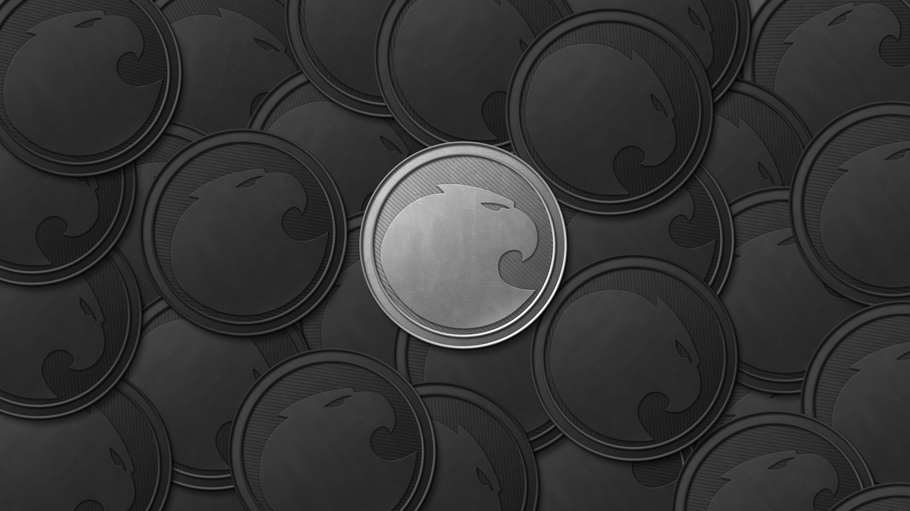

# Aragon Network Token 



Important resources:
- If integrating ANT in an exchange or automated system, please read: [A note for exchanges or holders interacting with ANT in an automated manner](https://blog.aragon.one/a-note-for-exchanges-or-holders-interacting-with-ant-in-an-automated-manner-fe13152c1b36)
- [Presale allocation details](/PRESALE.md)
- [Multisig structure](/MULTISIG.md)

## ABIs

Sale:

```
[{"constant":true,"inputs":[],"name":"initialPrice","outputs":[{"name":"","type":"uint256"}],"payable":false,"type":"function"},{"constant":true,"inputs":[],"name":"finalBlock","outputs":[{"name":"","type":"uint256"}],"payable":false,"type":"function"},{"constant":false,"inputs":[],"name":"emergencyStopSale","outputs":[],"payable":false,"type":"function"},{"constant":true,"inputs":[],"name":"initialBlock","outputs":[{"name":"","type":"uint256"}],"payable":false,"type":"function"},{"constant":true,"inputs":[],"name":"communityMultisig","outputs":[{"name":"","type":"address"}],"payable":false,"type":"function"},{"constant":true,"inputs":[{"name":"_blockNumber","type":"uint256"}],"name":"stageForBlock","outputs":[{"name":"","type":"uint8"}],"payable":false,"type":"function"},{"constant":true,"inputs":[],"name":"getBlockNumber","outputs":[{"name":"","type":"uint256"}],"payable":false,"type":"function"},{"constant":true,"inputs":[],"name":"saleStopped","outputs":[{"name":"","type":"bool"}],"payable":false,"type":"function"},{"constant":false,"inputs":[{"name":"_from","type":"address"},{"name":"_to","type":"address"},{"name":"_amount","type":"uint256"}],"name":"onTransfer","outputs":[{"name":"","type":"bool"}],"payable":false,"type":"function"},{"constant":true,"inputs":[],"name":"isActivated","outputs":[{"name":"","type":"bool"}],"payable":false,"type":"function"},{"constant":false,"inputs":[],"name":"finalizeSale","outputs":[],"payable":false,"type":"function"},{"constant":true,"inputs":[],"name":"priceStages","outputs":[{"name":"","type":"uint8"}],"payable":false,"type":"function"},{"constant":false,"inputs":[{"name":"_newMultisig","type":"address"}],"name":"setCommunityMultisig","outputs":[],"payable":false,"type":"function"},{"constant":false,"inputs":[],"name":"restartSale","outputs":[],"payable":false,"type":"function"},{"constant":true,"inputs":[{"name":"","type":"address"}],"name":"activated","outputs":[{"name":"","type":"bool"}],"payable":false,"type":"function"},{"constant":false,"inputs":[{"name":"networkAddress","type":"address"}],"name":"deployNetwork","outputs":[],"payable":false,"type":"function"},{"constant":true,"inputs":[],"name":"finalPrice","outputs":[{"name":"","type":"uint256"}],"payable":false,"type":"function"},{"constant":false,"inputs":[{"name":"_token","type":"address"},{"name":"_networkPlaceholder","type":"address"}],"name":"setANT","outputs":[],"payable":false,"type":"function"},{"constant":false,"inputs":[{"name":"_receiver","type":"address"},{"name":"_amount","type":"uint256"},{"name":"cliffDate","type":"uint64"},{"name":"vestingDate","type":"uint64"}],"name":"allocatePresaleTokens","outputs":[],"payable":false,"type":"function"},{"constant":false,"inputs":[],"name":"activateSale","outputs":[],"payable":false,"type":"function"},{"constant":true,"inputs":[],"name":"aragonDevMultisig","outputs":[{"name":"","type":"address"}],"payable":false,"type":"function"},{"constant":true,"inputs":[{"name":"_stage","type":"uint8"}],"name":"priceForStage","outputs":[{"name":"","type":"uint256"}],"payable":false,"type":"function"},{"constant":false,"inputs":[{"name":"_newMultisig","type":"address"}],"name":"setAragonDevMultisig","outputs":[],"payable":false,"type":"function"},{"constant":false,"inputs":[{"name":"_owner","type":"address"},{"name":"_spender","type":"address"},{"name":"_amount","type":"uint256"}],"name":"onApprove","outputs":[{"name":"","type":"bool"}],"payable":false,"type":"function"},{"constant":true,"inputs":[],"name":"networkPlaceholder","outputs":[{"name":"","type":"address"}],"payable":false,"type":"function"},{"constant":true,"inputs":[],"name":"totalCollected","outputs":[{"name":"","type":"uint256"}],"payable":false,"type":"function"},{"constant":true,"inputs":[{"name":"_blockNumber","type":"uint256"}],"name":"getPrice","outputs":[{"name":"","type":"uint256"}],"payable":false,"type":"function"},{"constant":false,"inputs":[{"name":"_owner","type":"address"}],"name":"proxyPayment","outputs":[{"name":"","type":"bool"}],"payable":true,"type":"function"},{"constant":true,"inputs":[],"name":"dust","outputs":[{"name":"","type":"uint256"}],"payable":false,"type":"function"},{"constant":true,"inputs":[],"name":"token","outputs":[{"name":"","type":"address"}],"payable":false,"type":"function"},{"inputs":[{"name":"_initialBlock","type":"uint256"},{"name":"_finalBlock","type":"uint256"},{"name":"_aragonDevMultisig","type":"address"},{"name":"_communityMultisig","type":"address"},{"name":"_initialPrice","type":"uint256"},{"name":"_finalPrice","type":"uint256"},{"name":"_priceStages","type":"uint8"}],"payable":false,"type":"constructor"},{"payable":true,"type":"fallback"}]
```


ANT:

```
[{"constant":false,"inputs":[{"name":"_to","type":"address"},{"name":"_value","type":"uint256"},{"name":"_start","type":"uint64"},{"name":"_cliff","type":"uint64"},{"name":"_vesting","type":"uint64"}],"name":"grantVestedTokens","outputs":[],"payable":false,"type":"function"},{"constant":true,"inputs":[{"name":"_holder","type":"address"}],"name":"tokenGrantsCount","outputs":[{"name":"index","type":"uint256"}],"payable":false,"type":"function"},{"constant":true,"inputs":[],"name":"name","outputs":[{"name":"","type":"string"}],"payable":false,"type":"function"},{"constant":false,"inputs":[{"name":"_spender","type":"address"},{"name":"_amount","type":"uint256"}],"name":"approve","outputs":[{"name":"success","type":"bool"}],"payable":false,"type":"function"},{"constant":true,"inputs":[],"name":"creationBlock","outputs":[{"name":"","type":"uint256"}],"payable":false,"type":"function"},{"constant":true,"inputs":[],"name":"totalSupply","outputs":[{"name":"","type":"uint256"}],"payable":false,"type":"function"},{"constant":false,"inputs":[{"name":"_from","type":"address"},{"name":"_to","type":"address"},{"name":"_value","type":"uint256"}],"name":"transferFrom","outputs":[{"name":"success","type":"bool"}],"payable":false,"type":"function"},{"constant":true,"inputs":[{"name":"","type":"address"},{"name":"","type":"uint256"}],"name":"grants","outputs":[{"name":"granter","type":"address"},{"name":"value","type":"uint256"},{"name":"cliff","type":"uint64"},{"name":"vesting","type":"uint64"},{"name":"start","type":"uint64"}],"payable":false,"type":"function"},{"constant":true,"inputs":[],"name":"decimals","outputs":[{"name":"","type":"uint8"}],"payable":false,"type":"function"},{"constant":false,"inputs":[{"name":"_newController","type":"address"}],"name":"changeController","outputs":[],"payable":false,"type":"function"},{"constant":true,"inputs":[{"name":"_owner","type":"address"},{"name":"_blockNumber","type":"uint256"}],"name":"balanceOfAt","outputs":[{"name":"","type":"uint256"}],"payable":false,"type":"function"},{"constant":true,"inputs":[],"name":"version","outputs":[{"name":"","type":"string"}],"payable":false,"type":"function"},{"constant":true,"inputs":[{"name":"_holder","type":"address"},{"name":"_grantId","type":"uint256"}],"name":"tokenGrant","outputs":[{"name":"granter","type":"address"},{"name":"value","type":"uint256"},{"name":"vested","type":"uint256"},{"name":"start","type":"uint64"},{"name":"cliff","type":"uint64"},{"name":"vesting","type":"uint64"}],"payable":false,"type":"function"},{"constant":false,"inputs":[{"name":"_cloneTokenName","type":"string"},{"name":"_cloneDecimalUnits","type":"uint8"},{"name":"_cloneTokenSymbol","type":"string"},{"name":"_snapshotBlock","type":"uint256"},{"name":"_transfersEnabled","type":"bool"}],"name":"createCloneToken","outputs":[{"name":"","type":"address"}],"payable":false,"type":"function"},{"constant":true,"inputs":[{"name":"holder","type":"address"}],"name":"lastTokenIsTransferableDate","outputs":[{"name":"date","type":"uint64"}],"payable":false,"type":"function"},{"constant":true,"inputs":[{"name":"_owner","type":"address"}],"name":"balanceOf","outputs":[{"name":"balance","type":"uint256"}],"payable":false,"type":"function"},{"constant":true,"inputs":[],"name":"parentToken","outputs":[{"name":"","type":"address"}],"payable":false,"type":"function"},{"constant":false,"inputs":[{"name":"_owner","type":"address"},{"name":"_amount","type":"uint256"}],"name":"generateTokens","outputs":[{"name":"","type":"bool"}],"payable":false,"type":"function"},{"constant":true,"inputs":[],"name":"symbol","outputs":[{"name":"","type":"string"}],"payable":false,"type":"function"},{"constant":true,"inputs":[{"name":"_blockNumber","type":"uint256"}],"name":"totalSupplyAt","outputs":[{"name":"","type":"uint256"}],"payable":false,"type":"function"},{"constant":false,"inputs":[{"name":"_to","type":"address"},{"name":"_value","type":"uint256"}],"name":"transfer","outputs":[{"name":"success","type":"bool"}],"payable":false,"type":"function"},{"constant":true,"inputs":[],"name":"transfersEnabled","outputs":[{"name":"","type":"bool"}],"payable":false,"type":"function"},{"constant":true,"inputs":[],"name":"parentSnapShotBlock","outputs":[{"name":"","type":"uint256"}],"payable":false,"type":"function"},{"constant":false,"inputs":[{"name":"_spender","type":"address"},{"name":"_amount","type":"uint256"},{"name":"_extraData","type":"bytes"}],"name":"approveAndCall","outputs":[{"name":"success","type":"bool"}],"payable":false,"type":"function"},{"constant":true,"inputs":[{"name":"holder","type":"address"},{"name":"time","type":"uint64"}],"name":"transferableTokens","outputs":[{"name":"nonVested","type":"uint256"}],"payable":false,"type":"function"},{"constant":false,"inputs":[{"name":"_owner","type":"address"},{"name":"_amount","type":"uint256"}],"name":"destroyTokens","outputs":[{"name":"","type":"bool"}],"payable":false,"type":"function"},{"constant":true,"inputs":[{"name":"_owner","type":"address"},{"name":"_spender","type":"address"}],"name":"allowance","outputs":[{"name":"remaining","type":"uint256"}],"payable":false,"type":"function"},{"constant":true,"inputs":[{"name":"tokens","type":"uint256"},{"name":"time","type":"uint256"},{"name":"start","type":"uint256"},{"name":"cliff","type":"uint256"},{"name":"vesting","type":"uint256"}],"name":"calculateVestedTokens","outputs":[{"name":"vestedTokens","type":"uint256"}],"payable":false,"type":"function"},{"constant":true,"inputs":[],"name":"tokenFactory","outputs":[{"name":"","type":"address"}],"payable":false,"type":"function"},{"constant":false,"inputs":[{"name":"_holder","type":"address"},{"name":"_grantId","type":"uint256"}],"name":"revokeTokenGrant","outputs":[],"payable":false,"type":"function"},{"constant":false,"inputs":[{"name":"_transfersEnabled","type":"bool"}],"name":"enableTransfers","outputs":[],"payable":false,"type":"function"},{"constant":true,"inputs":[],"name":"controller","outputs":[{"name":"","type":"address"}],"payable":false,"type":"function"},{"inputs":[{"name":"_tokenFactory","type":"address"}],"payable":false,"type":"constructor"},{"payable":true,"type":"fallback"},{"anonymous":false,"inputs":[{"indexed":true,"name":"_cloneToken","type":"address"},{"indexed":false,"name":"_snapshotBlock","type":"uint256"}],"name":"NewCloneToken","type":"event"},{"anonymous":false,"inputs":[{"indexed":true,"name":"from","type":"address"},{"indexed":true,"name":"to","type":"address"},{"indexed":false,"name":"value","type":"uint256"}],"name":"Transfer","type":"event"},{"anonymous":false,"inputs":[{"indexed":true,"name":"owner","type":"address"},{"indexed":true,"name":"spender","type":"address"},{"indexed":false,"name":"value","type":"uint256"}],"name":"Approval","type":"event"}]
```

MultiSig:

```
[{"constant":true,"inputs":[{"name":"","type":"uint256"}],"name":"owners","outputs":[{"name":"","type":"address"}],"payable":false,"type":"function"},{"constant":false,"inputs":[{"name":"owner","type":"address"}],"name":"removeOwner","outputs":[],"payable":false,"type":"function"},{"constant":false,"inputs":[{"name":"transactionId","type":"uint256"}],"name":"revokeConfirmation","outputs":[],"payable":false,"type":"function"},{"constant":true,"inputs":[{"name":"","type":"address"}],"name":"isOwner","outputs":[{"name":"","type":"bool"}],"payable":false,"type":"function"},{"constant":true,"inputs":[{"name":"","type":"uint256"},{"name":"","type":"address"}],"name":"confirmations","outputs":[{"name":"","type":"bool"}],"payable":false,"type":"function"},{"constant":true,"inputs":[{"name":"pending","type":"bool"},{"name":"executed","type":"bool"}],"name":"getTransactionCount","outputs":[{"name":"count","type":"uint256"}],"payable":false,"type":"function"},{"constant":false,"inputs":[{"name":"owner","type":"address"}],"name":"addOwner","outputs":[],"payable":false,"type":"function"},{"constant":true,"inputs":[{"name":"transactionId","type":"uint256"}],"name":"isConfirmed","outputs":[{"name":"","type":"bool"}],"payable":false,"type":"function"},{"constant":true,"inputs":[{"name":"transactionId","type":"uint256"}],"name":"getConfirmationCount","outputs":[{"name":"count","type":"uint256"}],"payable":false,"type":"function"},{"constant":true,"inputs":[{"name":"","type":"uint256"}],"name":"transactions","outputs":[{"name":"destination","type":"address"},{"name":"value","type":"uint256"},{"name":"data","type":"bytes"},{"name":"executed","type":"bool"}],"payable":false,"type":"function"},{"constant":true,"inputs":[],"name":"getOwners","outputs":[{"name":"","type":"address[]"}],"payable":false,"type":"function"},{"constant":true,"inputs":[{"name":"from","type":"uint256"},{"name":"to","type":"uint256"},{"name":"pending","type":"bool"},{"name":"executed","type":"bool"}],"name":"getTransactionIds","outputs":[{"name":"_transactionIds","type":"uint256[]"}],"payable":false,"type":"function"},{"constant":true,"inputs":[{"name":"transactionId","type":"uint256"}],"name":"getConfirmations","outputs":[{"name":"_confirmations","type":"address[]"}],"payable":false,"type":"function"},{"constant":true,"inputs":[],"name":"transactionCount","outputs":[{"name":"","type":"uint256"}],"payable":false,"type":"function"},{"constant":false,"inputs":[{"name":"_required","type":"uint256"}],"name":"changeRequirement","outputs":[],"payable":false,"type":"function"},{"constant":false,"inputs":[{"name":"transactionId","type":"uint256"}],"name":"confirmTransaction","outputs":[],"payable":false,"type":"function"},{"constant":false,"inputs":[{"name":"destination","type":"address"},{"name":"value","type":"uint256"},{"name":"data","type":"bytes"}],"name":"submitTransaction","outputs":[{"name":"transactionId","type":"uint256"}],"payable":false,"type":"function"},{"constant":true,"inputs":[],"name":"MAX_OWNER_COUNT","outputs":[{"name":"","type":"uint256"}],"payable":false,"type":"function"},{"constant":true,"inputs":[],"name":"required","outputs":[{"name":"","type":"uint256"}],"payable":false,"type":"function"},{"constant":false,"inputs":[{"name":"owner","type":"address"},{"name":"newOwner","type":"address"}],"name":"replaceOwner","outputs":[],"payable":false,"type":"function"},{"constant":false,"inputs":[{"name":"transactionId","type":"uint256"}],"name":"executeTransaction","outputs":[],"payable":false,"type":"function"},{"inputs":[{"name":"_owners","type":"address[]"},{"name":"_required","type":"uint256"}],"payable":false,"type":"constructor"},{"payable":true,"type":"fallback"},{"anonymous":false,"inputs":[{"indexed":true,"name":"sender","type":"address"},{"indexed":true,"name":"transactionId","type":"uint256"}],"name":"Confirmation","type":"event"},{"anonymous":false,"inputs":[{"indexed":true,"name":"sender","type":"address"},{"indexed":true,"name":"transactionId","type":"uint256"}],"name":"Revocation","type":"event"},{"anonymous":false,"inputs":[{"indexed":true,"name":"transactionId","type":"uint256"}],"name":"Submission","type":"event"},{"anonymous":false,"inputs":[{"indexed":true,"name":"transactionId","type":"uint256"}],"name":"Execution","type":"event"},{"anonymous":false,"inputs":[{"indexed":true,"name":"transactionId","type":"uint256"}],"name":"ExecutionFailure","type":"event"},{"anonymous":false,"inputs":[{"indexed":true,"name":"sender","type":"address"},{"indexed":false,"name":"value","type":"uint256"}],"name":"Deposit","type":"event"},{"anonymous":false,"inputs":[{"indexed":true,"name":"owner","type":"address"}],"name":"OwnerAddition","type":"event"},{"anonymous":false,"inputs":[{"indexed":true,"name":"owner","type":"address"}],"name":"OwnerRemoval","type":"event"},{"anonymous":false,"inputs":[{"indexed":false,"name":"required","type":"uint256"}],"name":"RequirementChange","type":"event"}]
```

## Technical definition

At the technical level ANT is a ERC20-compliant token, derived from the [MiniMe Token](https://github.com/Giveth/minime) that allows for token cloning (forking), which will be useful for many future usecases.

Also built in the token is a vesting schedule for limiting ANT transferability over time. Aragon Project founders, advisors, early contributors and presale partners all have vesting in their tokens.

ANT is slightly diverges with the ERC20 standard, on invalid token transactions or approvals it throws instead of returning false.

## Contracts

Token:

- [ANT.sol](/contracts/ANT.sol): Main contract for the token. Derives MiniMeIrrevocableVestedToken.
- [MiniMeIrrevocableVestedToken.sol](/contracts/MiniMeIrrevocableVestedToken.sol): Adds vesting to MiniMeToken. Derives MiniMeToken.
- [MiniMeToken.sol](/contracts/MiniMeToken.sol): Token implementation.

Sale:

- [AragonTokenSale.sol](/contracts/AragonTokenSale.sol): Implementation of the initial distribution of ANT.
- [ANPlaceholder.sol](/contracts/ANPlaceholder.sol): Placeholder for the Aragon Network before its deployment.

## Reviewers and audits

Code for the ANT token and the sale has been reviewed by:

- Jorge Izquierdo, Aragon (author).
- Jordi Baylina, MiniMe author. [Pending audit results](/)
- [Pending audit results](/)

A bug bounty for the ANT token and sale started on [pending date]. More details.

## ANT Initial Sale flow

Example of a successful testnet sale: https://kovan.etherscan.io/address/0x506E1db7DA1B3876eAcd2EdDf6ED551A7F2787D0

### Instantiation

#### 1. Deploy sale – 1,425,663 gas
Aragon token sale will be deployed 1 week prior to the beginning of the sale with the following parameters:

- Initial block: TBC
- Final block: Initial block + 172,800 (4 weeks)
- Aragon Dev Multisig: TBC (2/3 confirms multisig with Jorge, Luis, Security key that can only be reconstructed by Jorge and Luis).
- Community Multisig: TBC (3/5 confirms with Aragon Dev Multisig + 4 trusted members of community)
- Initial price: 100
- Final price: 66
- Price stages: 2
- Cap commitment: sealed commitment for the soft hidden cap.

#### 2. sale.setANT() – 95,427 gas
Set ANT needs to called from the Aragon Multisig. Its parameters are:

- ANT token address: An empty deployed instance of ANT.
- ANPlaceholder: A network placeholder with references to the Sale and ANT.
- Sale wallet: A contract that holds sale funds until final block.

Aragon Dev will perform setANT inmediately after deploying the sale so it is instantiated as soon as possible.

After deployANT has been called, the sale contract will have two public addresses available:

- token: The address of the official MiniMe ERC20 compatible Aragon Network Token.
- networkPlaceholder: The placeholder for the Aragon Network until its deployment.

The sale will be the token controller during the sale. After the sale it will be the network placeholder.

Aragon Dev will at this point prove the source code of the contracts in blockchain explorers.

### Presale

The presale is the period between full sale instantiation to the initialBlock of the sale.

During the presale it is required that the sale is activated, failing to activate the sale during this period, will cause the sale to never start.

#### 3. sale.allocatePresaleTokens() – 209,075 gas

Aragon dev will be able to allocate at its own discretion as many presale tokens as needed before the sale is activated.

Aragon dev will only issue presale token to presale partners that took part in a private sale done for gathering the funds needed for the sale.

Presale tokens have cliff and vesting for avoiding market dumps.

#### 4. sale.activateSale() – 2 * 42,862 gas

Both Aragon Dev and the Community Multisig must call activateSale in order to consider the sale activated.

When both multisigs have called this function, the sale will be activated and no more presale allocations will be allowed.

### Sale

If the presale is successful in activating the sale, the sale will start on the initial block.

#### 5. Buy tokens sale.fallback || token.fallback – 108,242 gas || 118,912 gas

After the sale is started, sending an ether amount greater than the dust value (1 finney) will result in tokens getting minted and assigned to the sender of the payment.

All the funds collected will be instantly sent to the Aragon Dev multisig for security.

Disclaimer: Please do not send from exchanges.


#### 6. sale.emergencyStopSale() – 43,864 gas

After the sale is activated, Aragon Dev will be able to stop the sale for an emergency.

#### 7. sale.restartSale() – 14,031 gas

After the sale has been stopped for an emergency and the sale is still ongoing, Aragon Dev will be able to restart it.

After the sale has ended, it cannot be restarted. The sale can end in a stopped state without problem, but if enabled to restart after ending it could allow Aragon Dev to block the deployment of the network by the community multisig.

### After sale

The after sale period is considered from the final block (inclusive) until the sale contract is destroyed.

#### 8. sale.finalizeSale() – 105,348 gas

This method will mint an additional 3/7 of tokens so at the end of the sale Aragon Dev will own 30% of all the ANT supply.

In the process of doing so, it will make the ANPlaceholder the controller of the token contract. Which will make the token supply be constant until the network is deployed and it implements a new minting policy.

#### 9. sale.deployNetwork() – 22, 338 gas

After the sale is finalized, the community multisig will be able to provide the address of the already deployed Aragon Network.

The ANPlaceholder will transfer its Token Controller power and it will be able to mint further tokens if the network governance decides so.

The sale contract is now suicided in favor of the network, though it shouldn't have any ether.


### Token operations

#### transfer – 95,121 gas
#### grantVestedTokens – 163,094 gas
